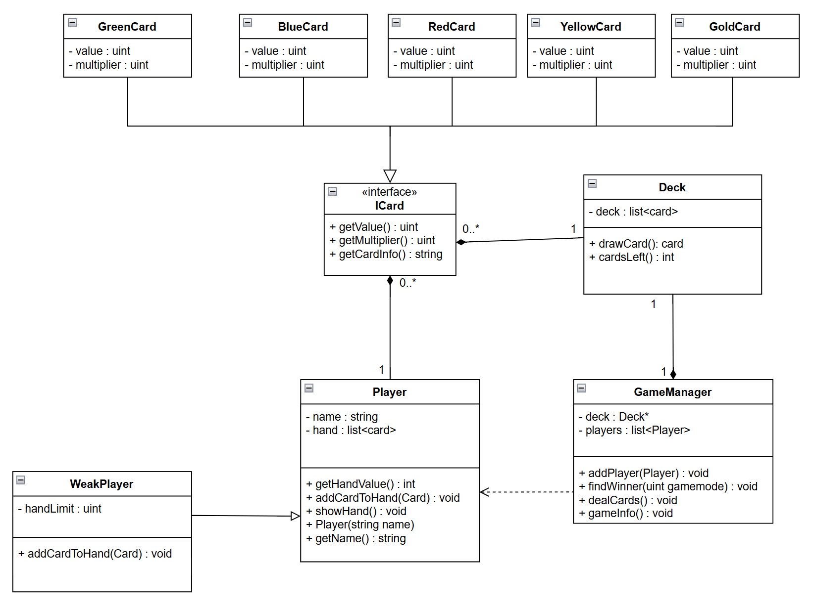

### Exercise 1:
Draw a domain model of the card game. As you do, look at the details above and ask yourself:
1. What is the state (“knowledge”) of each domain class?
2. What is the behavior (“responsibility”) of each domain class?
3. What other classes do the individual domain classes relate to? 
**SOLUTION:**

### Exercise 2:
Create a design of the system. In doing so, be sure to think about how to encapsulate the “knowledge” of each class
and how to expose the necessary behavior of each class. 
**SOLUTION:**  
What kind of design ?

### Exercise 3:
Implement your game and test it: Add 3 players, deal each player 5 cards, have them show their hands and then have
the winner announced. Compare the shown hands to the announced winner - is the result correct? 
**SOLUTION:**  
After test of the program it worked as expected.

### Exercise 4:
A new kind of player enters the game – the weak player. This kind of player is just like the regular player, but the poor
fellow can only hold 3 cards at any time. Whenever he is dealt a fourth card, he will “drop” one of the cards he is
holding. 
Redesign your solution so that the weak player may play just as ordinary players. Think about what behavior and state
weak players and ordinary players share, and what is particular to the individual kinds of players. If you find that the
addition of a weak player to your design requires changes to any other part of the system, be sure to discuss why and
how this impact can be removed – with a proper design, this change will have zero impact on classes other that the
Player class.  
**SOLUTION:**  
I just added a new class called WeakPlayer that inherits from the Player class. I modified the Player class so the AddCardToHand method was virtual so it could be overwritten. I also changed the private variables such has the name string and hand list from private to protected so the WeakPlayer class would inherite them. Then i added a private variable called handLimit to the WeakPlayer class and used it in the override of the AddCardToHand function to limit the hand size.

### Exercise 5:
A new card suit is created, the Gold card. This card also has card numbers in the range 1-8, but has a multiplier of 5.
Add this card to your game. Just like before, if you find that this addition impacts other classes, be sure to understand
which classes and discuss how this impact can be removed – again, with a proper design, this change will have zero
impact on classes other than the Card class. 
**SOLUTION:** 
This was really easy. I just added a new class GoldCard that inherits from the Card interface class. Then i added a line in the constructor of the deck to add some gold cards to the deck

### Exercise 6:
A new game variant is introduced: In this game, it is the player with the lowest sum of cards that wins. Introduce this
variant to the design.  
**SOLUTION:** 
This was accomplished by taking a parameter in the FindWinner function in my GameManager class. This variable was an uint that could be zero or one for the two gamemodes. I then changed the program so the user could input wich gamemode the game should be played in.